# Sequence Diagrams

Mermaid sequence diagrams for the key flows in drugs-quiz.

## 1. Request Flow: Browser to drug-gate API

The production request path through nginx, BFF proxy, and upstream API.

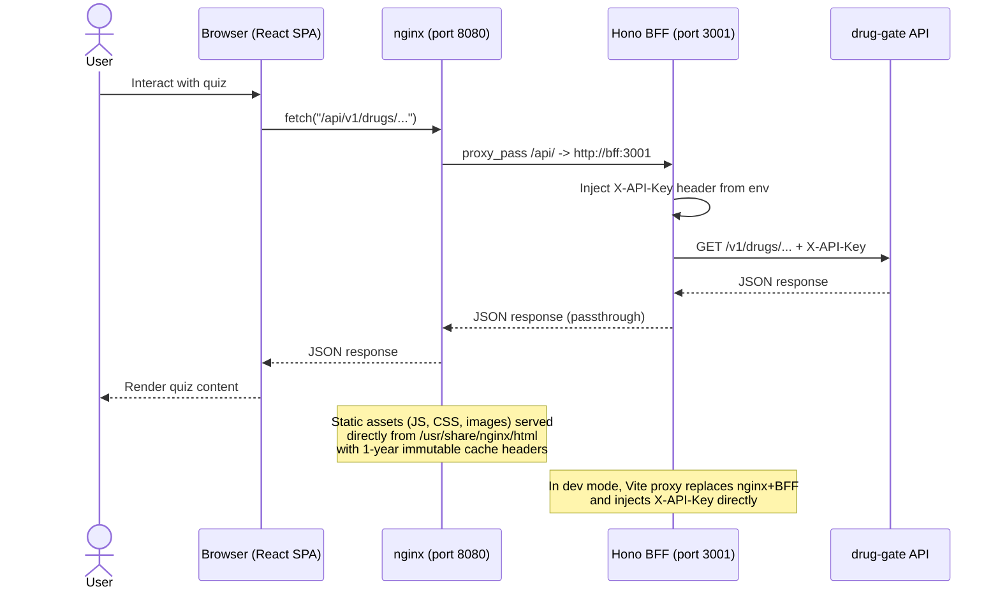
```mermaid
sequenceDiagram
    actor User
    participant Browser as Browser (React SPA)
    participant Nginx as nginx (port 8080)
    participant BFF as Hono BFF (port 3001)
    participant DrugGate as drug-gate API

    User->>Browser: Interact with quiz
    Browser->>Nginx: fetch("/api/v1/drugs/...")
    Nginx->>BFF: proxy_pass /api/ -> http://bff:3001
    BFF->>BFF: Inject X-API-Key header from env
    BFF->>DrugGate: GET /v1/drugs/... + X-API-Key
    DrugGate-->>BFF: JSON response
    BFF-->>Nginx: JSON response (passthrough)
    Nginx-->>Browser: JSON response
    Browser-->>User: Render quiz content

    Note over Nginx: Static assets (JS, CSS, images) served<br/>directly from /usr/share/nginx/html<br/>with 1-year immutable cache headers
    Note over BFF: In dev mode, Vite proxy replaces nginx+BFF<br/>and injects X-API-Key directly
```

## 2. Quiz Session Flow (Full Lifecycle)

The end-to-end flow from user configuration through question generation, answering, and results. Includes progressive loading (first 2 questions generated synchronously, rest generated in background).

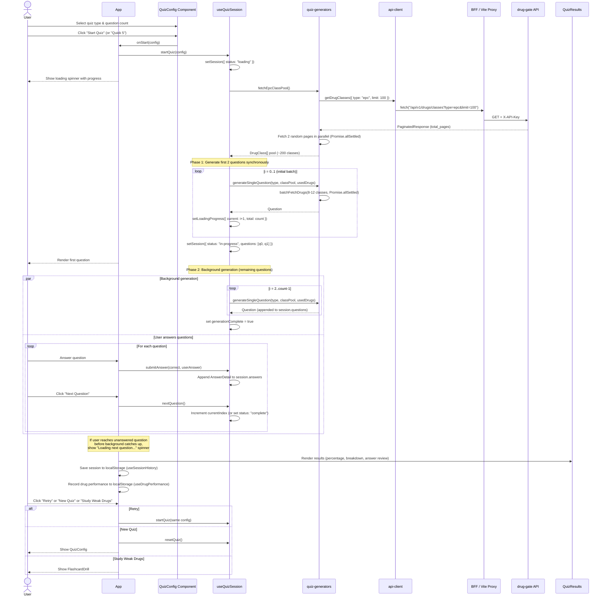
```mermaid
sequenceDiagram
    actor User
    participant App
    participant QuizConfig as QuizConfig Component
    participant Hook as useQuizSession
    participant Gen as quiz-generators
    participant API as api-client
    participant BFF as BFF / Vite Proxy
    participant DrugGate as drug-gate API

    User->>QuizConfig: Select quiz type & question count
    User->>QuizConfig: Click "Start Quiz" (or "Quick 5")
    QuizConfig->>App: onStart(config)
    App->>Hook: startQuiz(config)
    Hook->>Hook: setSession({ status: "loading" })
    App-->>User: Show loading spinner with progress

    Hook->>Gen: fetchEpcClassPool()
    Gen->>API: getDrugClasses({ type: "epc", limit: 100 })
    API->>BFF: fetch("/api/v1/drugs/classes?type=epc&limit=100")
    BFF->>DrugGate: GET + X-API-Key
    DrugGate-->>Gen: PaginatedResponse (total_pages)
    Gen->>Gen: Fetch 2 random pages in parallel (Promise.allSettled)
    Gen-->>Hook: DrugClass[] pool (~200 classes)

    Note over Hook: Phase 1: Generate first 2 questions synchronously
    loop i = 0..1 (initial batch)
        Hook->>Gen: generateSingleQuestion(type, classPool, usedDrugs)
        Gen->>Gen: batchFetchDrugs(8-12 classes, Promise.allSettled)
        Gen-->>Hook: Question
        Hook->>Hook: setLoadingProgress({ current: i+1, total: count })
    end

    Hook->>Hook: setSession({ status: "in-progress", questions: [q0, q1] })
    App-->>User: Render first question

    Note over Hook: Phase 2: Background generation (remaining questions)
    par Background generation
        loop i = 2..count-1
            Hook->>Gen: generateSingleQuestion(type, classPool, usedDrugs)
            Gen-->>Hook: Question (appended to session.questions)
        end
        Hook->>Hook: set generationComplete = true
    and User answers questions
        loop For each question
            User->>App: Answer question
            App->>Hook: submitAnswer(correct, userAnswer)
            Hook->>Hook: Append AnswerDetail to session.answers
            User->>App: Click "Next Question"
            App->>Hook: nextQuestion()
            Hook->>Hook: Increment currentIndex (or set status: "complete")
        end
    end

    Note over App: If user reaches unanswered question<br/>before background catches up,<br/>show "Loading next question..." spinner

    App->>QuizResults: Render results (percentage, breakdown, answer review)
    App->>App: Save session to localStorage (useSessionHistory)
    App->>App: Record drug performance to localStorage (useDrugPerformance)

    User-->>App: Click "Retry" or "New Quiz" or "Study Weak Drugs"
    alt Retry
        App->>Hook: startQuiz(same config)
    else New Quiz
        App->>Hook: resetQuiz()
        App-->>User: Show QuizConfig
    else Study Weak Drugs
        App-->>User: Show FlashcardDrill
    end
```

## 3. Quiz Generation: Batched Pre-Fetching

How question generators use `batchFetchDrugs` with `Promise.allSettled` to parallelize API calls and avoid waterfall latency.

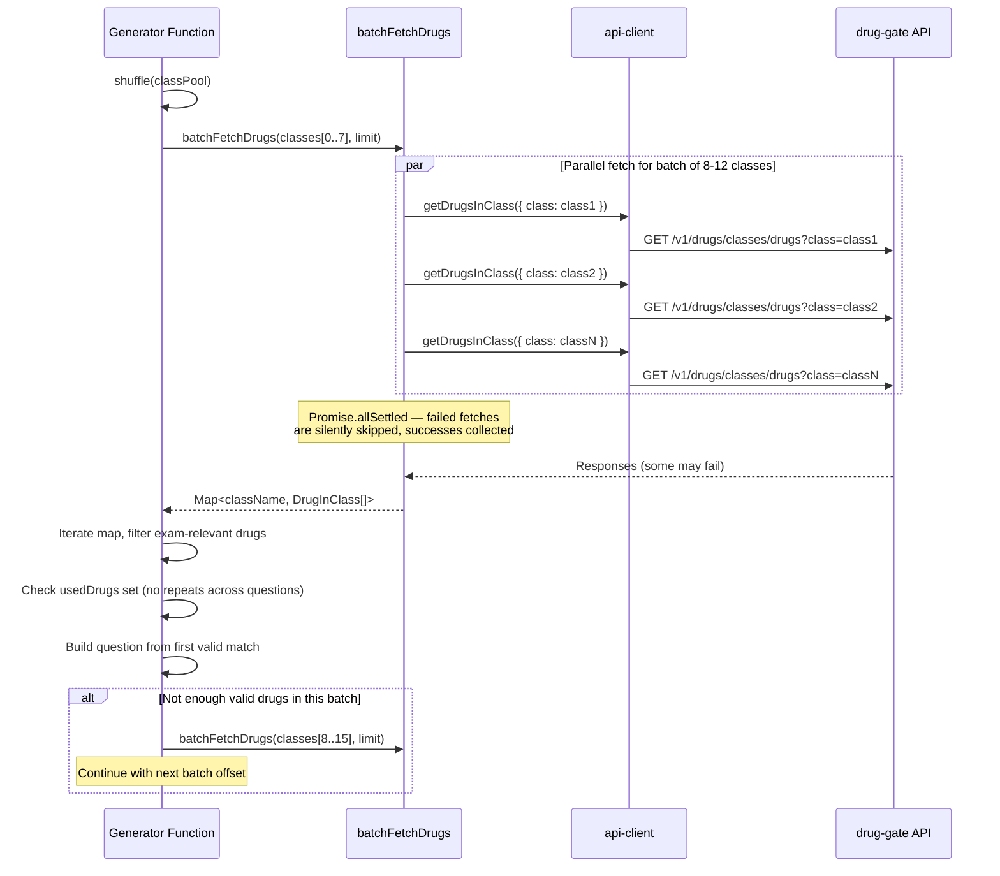
```mermaid
sequenceDiagram
    participant Gen as Generator Function
    participant Batch as batchFetchDrugs
    participant API as api-client
    participant DrugGate as drug-gate API

    Gen->>Gen: shuffle(classPool)
    Gen->>Batch: batchFetchDrugs(classes[0..7], limit)

    par Parallel fetch for batch of 8-12 classes
        Batch->>API: getDrugsInClass({ class: class1 })
        API->>DrugGate: GET /v1/drugs/classes/drugs?class=class1
        Batch->>API: getDrugsInClass({ class: class2 })
        API->>DrugGate: GET /v1/drugs/classes/drugs?class=class2
        Batch->>API: getDrugsInClass({ class: classN })
        API->>DrugGate: GET /v1/drugs/classes/drugs?class=classN
    end

    Note over Batch: Promise.allSettled — failed fetches<br/>are silently skipped, successes collected

    DrugGate-->>Batch: Responses (some may fail)
    Batch-->>Gen: Map<className, DrugInClass[]>

    Gen->>Gen: Iterate map, filter exam-relevant drugs
    Gen->>Gen: Check usedDrugs set (no repeats across questions)
    Gen->>Gen: Build question from first valid match

    alt Not enough valid drugs in this batch
        Gen->>Batch: batchFetchDrugs(classes[8..15], limit)
        Note over Gen: Continue with next batch offset
    end
```

## 4. Name the Class Question Generation

Implements the "Name the Class" recipe. Uses batched pre-fetch.

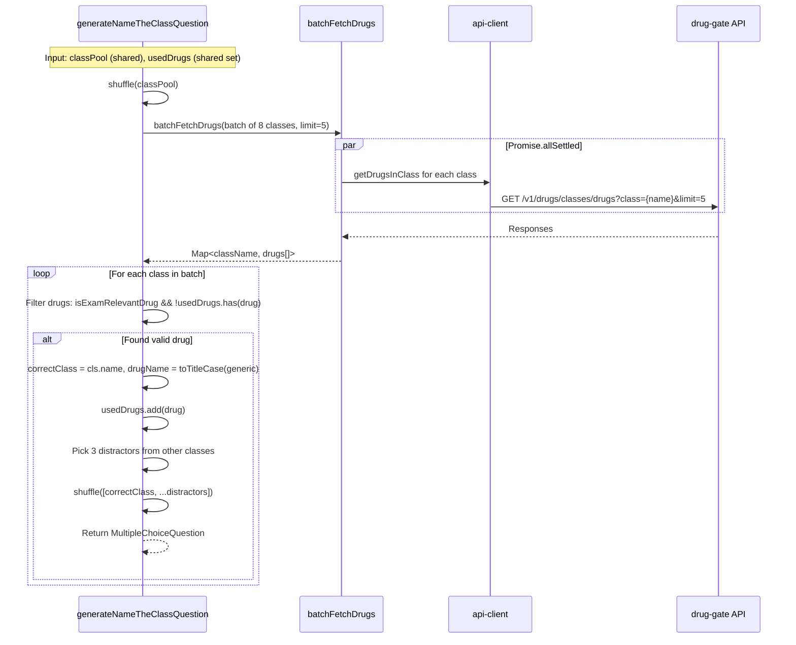
```mermaid
sequenceDiagram
    participant Gen as generateNameTheClassQuestion
    participant Batch as batchFetchDrugs
    participant API as api-client
    participant DrugGate as drug-gate API

    Note over Gen: Input: classPool (shared), usedDrugs (shared set)
    Gen->>Gen: shuffle(classPool)

    Gen->>Batch: batchFetchDrugs(batch of 8 classes, limit=5)
    par Promise.allSettled
        Batch->>API: getDrugsInClass for each class
        API->>DrugGate: GET /v1/drugs/classes/drugs?class={name}&limit=5
    end
    DrugGate-->>Batch: Responses
    Batch-->>Gen: Map<className, drugs[]>

    loop For each class in batch
        Gen->>Gen: Filter drugs: isExamRelevantDrug && !usedDrugs.has(drug)
        alt Found valid drug
            Gen->>Gen: correctClass = cls.name, drugName = toTitleCase(generic)
            Gen->>Gen: usedDrugs.add(drug)
            Gen->>Gen: Pick 3 distractors from other classes
            Gen->>Gen: shuffle([correctClass, ...distractors])
            Gen-->>Gen: Return MultipleChoiceQuestion
        end
    end
```

## 5. Match Drug to Class Question Generation

Implements the "Match Drug to Class" recipe. Needs 4 class-drug pairs.

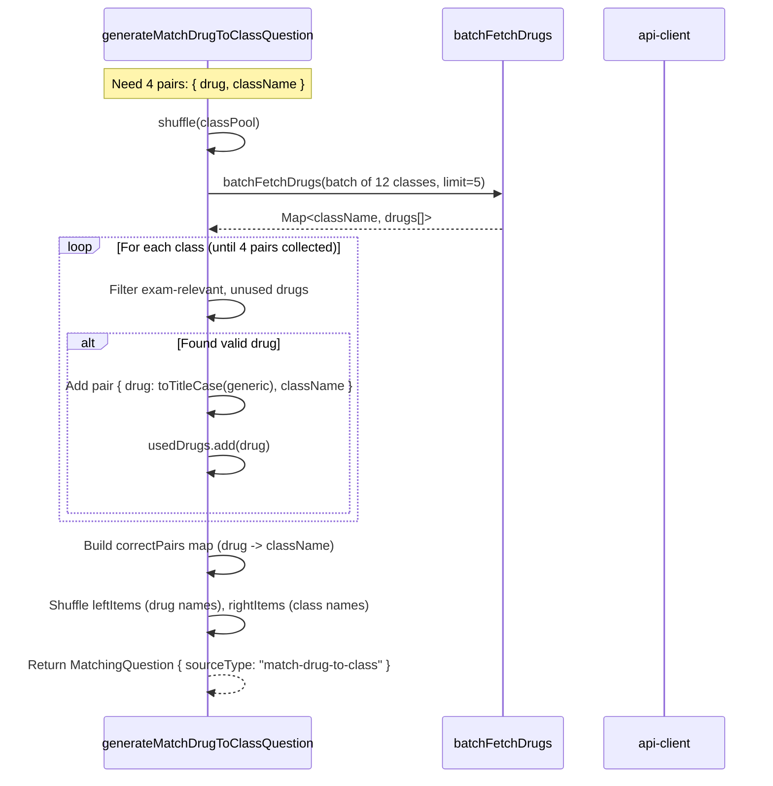
```mermaid
sequenceDiagram
    participant Gen as generateMatchDrugToClassQuestion
    participant Batch as batchFetchDrugs
    participant API as api-client

    Note over Gen: Need 4 pairs: { drug, className }
    Gen->>Gen: shuffle(classPool)

    Gen->>Batch: batchFetchDrugs(batch of 12 classes, limit=5)
    Batch-->>Gen: Map<className, drugs[]>

    loop For each class (until 4 pairs collected)
        Gen->>Gen: Filter exam-relevant, unused drugs
        alt Found valid drug
            Gen->>Gen: Add pair { drug: toTitleCase(generic), className }
            Gen->>Gen: usedDrugs.add(drug)
        end
    end

    Gen->>Gen: Build correctPairs map (drug -> className)
    Gen->>Gen: Shuffle leftItems (drug names), rightItems (class names)
    Gen-->>Gen: Return MatchingQuestion { sourceType: "match-drug-to-class" }
```

## 6. Brand/Generic Match Question Generation

Implements the "Brand/Generic Match" recipe. Needs 4 pairs with real brand names.

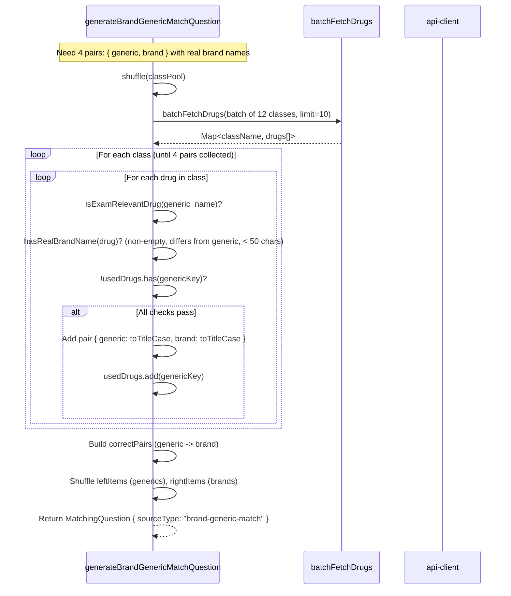
```mermaid
sequenceDiagram
    participant Gen as generateBrandGenericMatchQuestion
    participant Batch as batchFetchDrugs
    participant API as api-client

    Note over Gen: Need 4 pairs: { generic, brand } with real brand names
    Gen->>Gen: shuffle(classPool)

    Gen->>Batch: batchFetchDrugs(batch of 12 classes, limit=10)
    Batch-->>Gen: Map<className, drugs[]>

    loop For each class (until 4 pairs collected)
        loop For each drug in class
            Gen->>Gen: isExamRelevantDrug(generic_name)?
            Gen->>Gen: hasRealBrandName(drug)? (non-empty, differs from generic, < 50 chars)
            Gen->>Gen: !usedDrugs.has(genericKey)?
            alt All checks pass
                Gen->>Gen: Add pair { generic: toTitleCase, brand: toTitleCase }
                Gen->>Gen: usedDrugs.add(genericKey)
            end
        end
    end

    Gen->>Gen: Build correctPairs (generic -> brand)
    Gen->>Gen: Shuffle leftItems (generics), rightItems (brands)
    Gen-->>Gen: Return MatchingQuestion { sourceType: "brand-generic-match" }
```

## 7. Spaced Repetition: Drug Performance Tracking

How individual drug results are tracked in localStorage and used for flashcard drills.

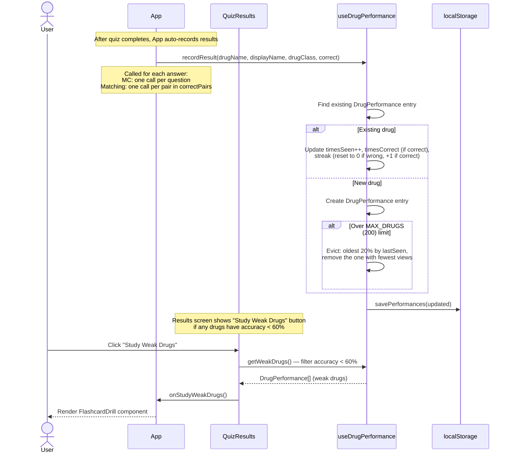
```mermaid
sequenceDiagram
    actor User
    participant App
    participant Results as QuizResults
    participant PerfHook as useDrugPerformance
    participant Storage as localStorage

    Note over App: After quiz completes, App auto-records results
    App->>PerfHook: recordResult(drugName, displayName, drugClass, correct)
    Note over App: Called for each answer:<br/>MC: one call per question<br/>Matching: one call per pair in correctPairs

    PerfHook->>PerfHook: Find existing DrugPerformance entry
    alt Existing drug
        PerfHook->>PerfHook: Update timesSeen++, timesCorrect (if correct),<br/>streak (reset to 0 if wrong, +1 if correct)
    else New drug
        PerfHook->>PerfHook: Create DrugPerformance entry
        alt Over MAX_DRUGS (200) limit
            PerfHook->>PerfHook: Evict: oldest 20% by lastSeen,<br/>remove the one with fewest views
        end
    end
    PerfHook->>Storage: savePerformances(updated)

    Note over Results: Results screen shows "Study Weak Drugs" button<br/>if any drugs have accuracy < 60%

    User->>Results: Click "Study Weak Drugs"
    Results->>PerfHook: getWeakDrugs() — filter accuracy < 60%
    PerfHook-->>Results: DrugPerformance[] (weak drugs)
    Results->>App: onStudyWeakDrugs()
    App-->>User: Render FlashcardDrill component
```

## 8. Flashcard Drill Flow

Interactive study mode for weak drugs identified by spaced repetition.

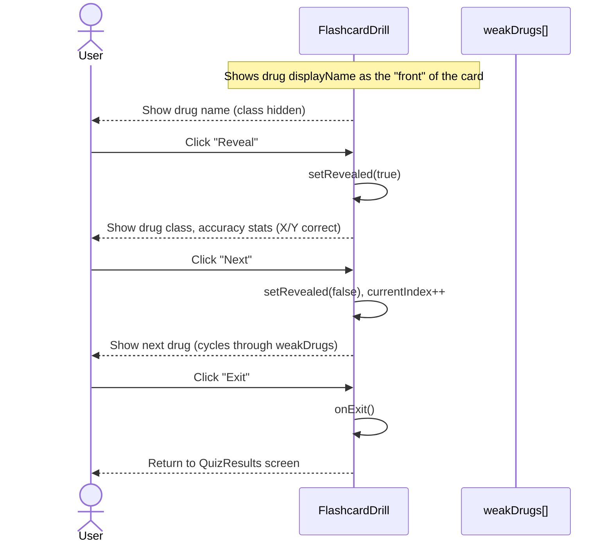
```mermaid
sequenceDiagram
    actor User
    participant Flash as FlashcardDrill
    participant Data as weakDrugs[]

    Note over Flash: Shows drug displayName as the "front" of the card
    Flash-->>User: Show drug name (class hidden)

    User->>Flash: Click "Reveal"
    Flash->>Flash: setRevealed(true)
    Flash-->>User: Show drug class, accuracy stats (X/Y correct)

    User->>Flash: Click "Next"
    Flash->>Flash: setRevealed(false), currentIndex++
    Flash-->>User: Show next drug (cycles through weakDrugs)

    User->>Flash: Click "Exit"
    Flash->>Flash: onExit()
    Flash-->>User: Return to QuizResults screen
```

## 9. Session History and Personal Best

How completed sessions are persisted and displayed on the config screen.

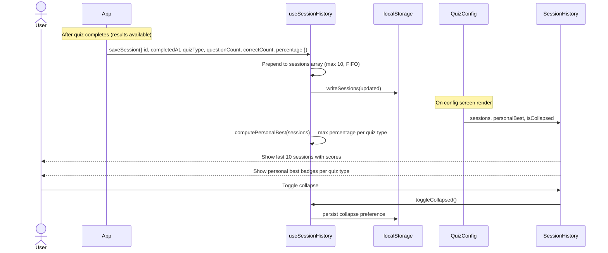
```mermaid
sequenceDiagram
    actor User
    participant App
    participant HistHook as useSessionHistory
    participant Storage as localStorage
    participant Config as QuizConfig
    participant History as SessionHistory

    Note over App: After quiz completes (results available)
    App->>HistHook: saveSession({ id, completedAt, quizType, questionCount, correctCount, percentage })
    HistHook->>HistHook: Prepend to sessions array (max 10, FIFO)
    HistHook->>Storage: writeSessions(updated)

    Note over Config: On config screen render
    Config->>History: sessions, personalBest, isCollapsed
    HistHook->>HistHook: computePersonalBest(sessions) — max percentage per quiz type
    History-->>User: Show last 10 sessions with scores
    History-->>User: Show personal best badges per quiz type

    User->>History: Toggle collapse
    History->>HistHook: toggleCollapsed()
    HistHook->>Storage: persist collapse preference
```

## 10. Quick 5 Entry Point

Fast-start mixed quiz mode that bypasses full configuration.

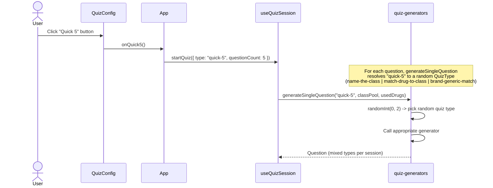
```mermaid
sequenceDiagram
    actor User
    participant Config as QuizConfig
    participant App
    participant Hook as useQuizSession
    participant Gen as quiz-generators

    User->>Config: Click "Quick 5" button
    Config->>App: onQuick5()
    App->>Hook: startQuiz({ type: "quick-5", questionCount: 5 })

    Note over Gen: For each question, generateSingleQuestion<br/>resolves "quick-5" to a random QuizType<br/>(name-the-class | match-drug-to-class | brand-generic-match)

    Hook->>Gen: generateSingleQuestion("quick-5", classPool, usedDrugs)
    Gen->>Gen: randomInt(0, 2) -> pick random quiz type
    Gen->>Gen: Call appropriate generator
    Gen-->>Hook: Question (mixed types per session)
```

## 11. Answer Review Flow

Inline feedback during quiz and detailed review on results screen.

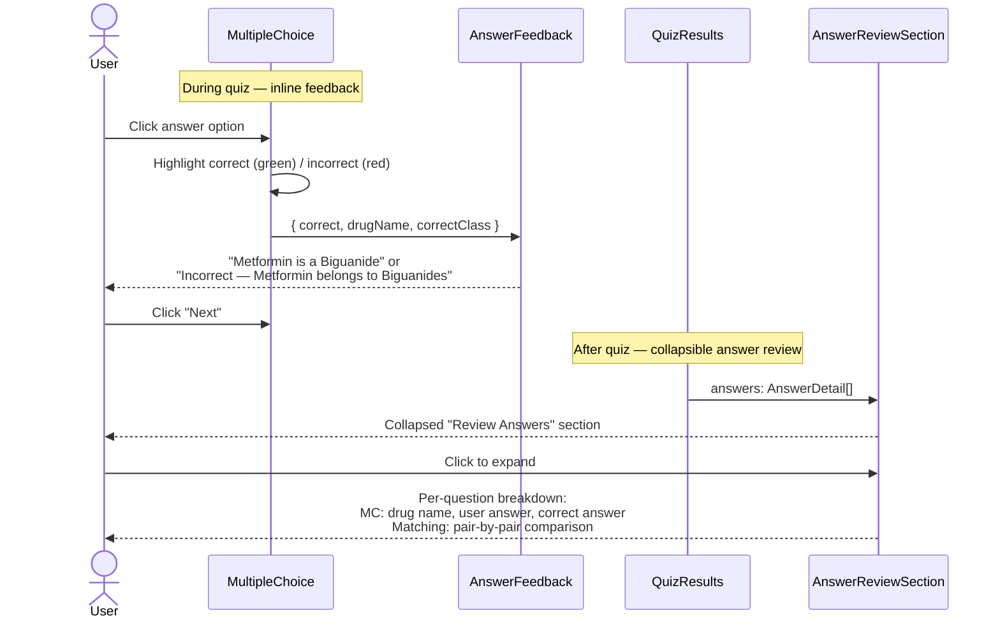
```mermaid
sequenceDiagram
    actor User
    participant MC as MultipleChoice
    participant Feedback as AnswerFeedback
    participant Results as QuizResults
    participant Review as AnswerReviewSection

    Note over MC: During quiz — inline feedback
    User->>MC: Click answer option
    MC->>MC: Highlight correct (green) / incorrect (red)
    MC->>Feedback: { correct, drugName, correctClass }
    Feedback-->>User: "Metformin is a Biguanide" or<br/>"Incorrect — Metformin belongs to Biguanides"

    User->>MC: Click "Next"

    Note over Results: After quiz — collapsible answer review
    Results->>Review: answers: AnswerDetail[]
    Review-->>User: Collapsed "Review Answers" section

    User->>Review: Click to expand
    Review-->>User: Per-question breakdown:<br/>MC: drug name, user answer, correct answer<br/>Matching: pair-by-pair comparison
```

## 12. Error Handling Flow

How API failures propagate from the network layer up to the user.

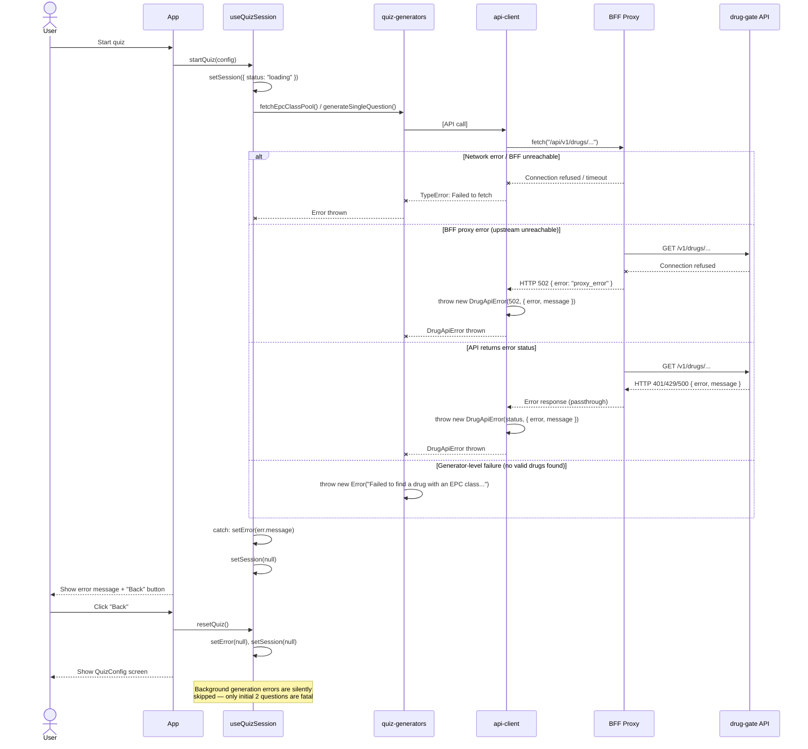
```mermaid
sequenceDiagram
    actor User
    participant App
    participant Hook as useQuizSession
    participant Gen as quiz-generators
    participant API as api-client
    participant BFF as BFF Proxy
    participant DrugGate as drug-gate API

    User->>App: Start quiz
    App->>Hook: startQuiz(config)
    Hook->>Hook: setSession({ status: "loading" })
    Hook->>Gen: fetchEpcClassPool() / generateSingleQuestion()

    Gen->>API: [API call]
    API->>BFF: fetch("/api/v1/drugs/...")

    alt Network error / BFF unreachable
        BFF--xAPI: Connection refused / timeout
        API--xGen: TypeError: Failed to fetch
        Gen--xHook: Error thrown
    else BFF proxy error (upstream unreachable)
        BFF->>DrugGate: GET /v1/drugs/...
        DrugGate--xBFF: Connection refused
        BFF-->>API: HTTP 502 { error: "proxy_error" }
        API->>API: throw new DrugApiError(502, { error, message })
        API--xGen: DrugApiError thrown
    else API returns error status
        BFF->>DrugGate: GET /v1/drugs/...
        DrugGate-->>BFF: HTTP 401/429/500 { error, message }
        BFF-->>API: Error response (passthrough)
        API->>API: throw new DrugApiError(status, { error, message })
        API--xGen: DrugApiError thrown
    else Generator-level failure (no valid drugs found)
        Gen->>Gen: throw new Error("Failed to find a drug with an EPC class...")
    end

    Hook->>Hook: catch: setError(err.message)
    Hook->>Hook: setSession(null)
    App-->>User: Show error message + "Back" button

    User->>App: Click "Back"
    App->>Hook: resetQuiz()
    Hook->>Hook: setError(null), setSession(null)
    App-->>User: Show QuizConfig screen

    Note over Hook: Background generation errors are silently<br/>skipped — only initial 2 questions are fatal
```

## 13. Google OAuth Login Flow

The full authentication flow from browser click through Google consent to JWT session.

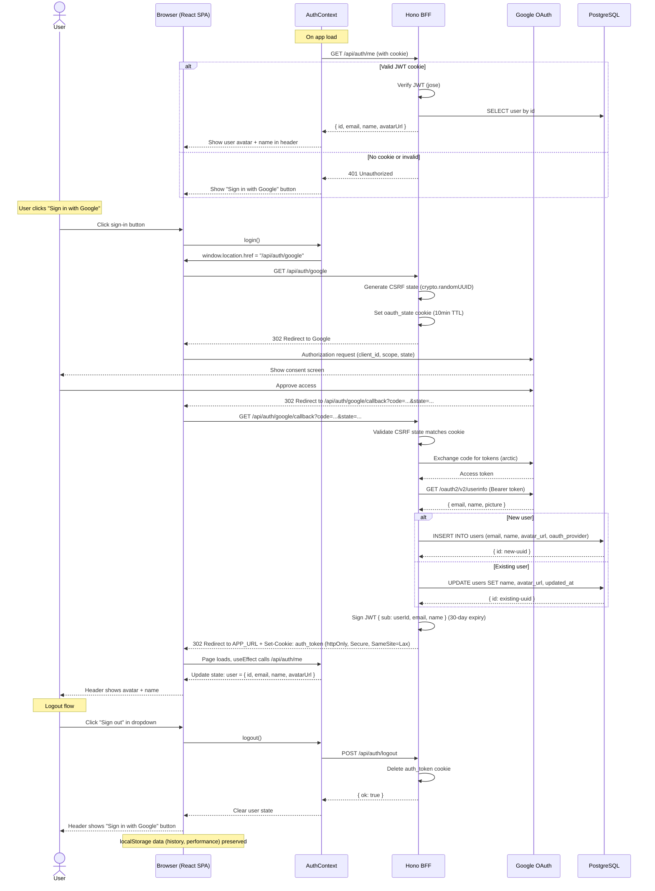
```mermaid
sequenceDiagram
    actor User
    participant Browser as Browser (React SPA)
    participant Auth as AuthContext
    participant BFF as Hono BFF
    participant Google as Google OAuth
    participant DB as PostgreSQL

    Note over Auth: On app load
    Auth->>BFF: GET /api/auth/me (with cookie)
    alt Valid JWT cookie
        BFF->>BFF: Verify JWT (jose)
        BFF->>DB: SELECT user by id
        BFF-->>Auth: { id, email, name, avatarUrl }
        Auth-->>Browser: Show user avatar + name in header
    else No cookie or invalid
        BFF-->>Auth: 401 Unauthorized
        Auth-->>Browser: Show "Sign in with Google" button
    end

    Note over User: User clicks "Sign in with Google"
    User->>Browser: Click sign-in button
    Browser->>Auth: login()
    Auth->>Browser: window.location.href = "/api/auth/google"
    Browser->>BFF: GET /api/auth/google
    BFF->>BFF: Generate CSRF state (crypto.randomUUID)
    BFF->>BFF: Set oauth_state cookie (10min TTL)
    BFF-->>Browser: 302 Redirect to Google

    Browser->>Google: Authorization request (client_id, scope, state)
    Google-->>User: Show consent screen
    User->>Google: Approve access
    Google-->>Browser: 302 Redirect to /api/auth/google/callback?code=...&state=...

    Browser->>BFF: GET /api/auth/google/callback?code=...&state=...
    BFF->>BFF: Validate CSRF state matches cookie
    BFF->>Google: Exchange code for tokens (arctic)
    Google-->>BFF: Access token
    BFF->>Google: GET /oauth2/v2/userinfo (Bearer token)
    Google-->>BFF: { email, name, picture }

    alt New user
        BFF->>DB: INSERT INTO users (email, name, avatar_url, oauth_provider)
        DB-->>BFF: { id: new-uuid }
    else Existing user
        BFF->>DB: UPDATE users SET name, avatar_url, updated_at
        DB-->>BFF: { id: existing-uuid }
    end

    BFF->>BFF: Sign JWT { sub: userId, email, name } (30-day expiry)
    BFF-->>Browser: 302 Redirect to APP_URL + Set-Cookie: auth_token (httpOnly, Secure, SameSite=Lax)
    Browser->>Auth: Page loads, useEffect calls /api/auth/me
    Auth-->>Browser: Update state: user = { id, email, name, avatarUrl }
    Browser-->>User: Header shows avatar + name

    Note over User: Logout flow
    User->>Browser: Click "Sign out" in dropdown
    Browser->>Auth: logout()
    Auth->>BFF: POST /api/auth/logout
    BFF->>BFF: Delete auth_token cookie
    BFF-->>Auth: { ok: true }
    Auth-->>Browser: Clear user state
    Browser-->>User: Header shows "Sign in with Google" button
    Note over Browser: localStorage data (history, performance) preserved
```

## 14. Deploy Webhook Flow (CI to Staging)

How GitHub Actions triggers a staging deployment via the deploy-hook service.

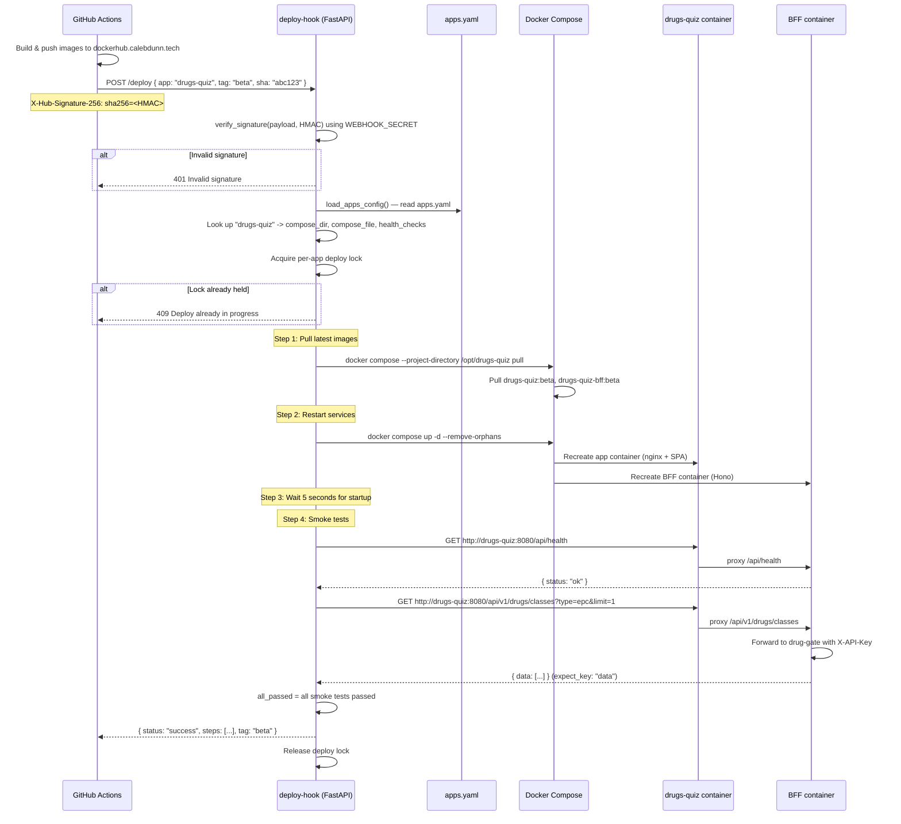
```mermaid
sequenceDiagram
    participant CI as GitHub Actions
    participant Hook as deploy-hook (FastAPI)
    participant Config as apps.yaml
    participant Docker as Docker Compose
    participant App as drugs-quiz container
    participant BFF as BFF container

    CI->>CI: Build & push images to dockerhub.calebdunn.tech
    CI->>Hook: POST /deploy { app: "drugs-quiz", tag: "beta", sha: "abc123" }
    Note over CI: X-Hub-Signature-256: sha256=<HMAC>

    Hook->>Hook: verify_signature(payload, HMAC) using WEBHOOK_SECRET
    alt Invalid signature
        Hook-->>CI: 401 Invalid signature
    end

    Hook->>Config: load_apps_config() — read apps.yaml
    Hook->>Hook: Look up "drugs-quiz" -> compose_dir, compose_file, health_checks

    Hook->>Hook: Acquire per-app deploy lock
    alt Lock already held
        Hook-->>CI: 409 Deploy already in progress
    end

    Note over Hook: Step 1: Pull latest images
    Hook->>Docker: docker compose --project-directory /opt/drugs-quiz pull
    Docker->>Docker: Pull drugs-quiz:beta, drugs-quiz-bff:beta

    Note over Hook: Step 2: Restart services
    Hook->>Docker: docker compose up -d --remove-orphans
    Docker->>App: Recreate app container (nginx + SPA)
    Docker->>BFF: Recreate BFF container (Hono)

    Note over Hook: Step 3: Wait 5 seconds for startup

    Note over Hook: Step 4: Smoke tests
    Hook->>App: GET http://drugs-quiz:8080/api/health
    App->>BFF: proxy /api/health
    BFF-->>Hook: { status: "ok" }

    Hook->>App: GET http://drugs-quiz:8080/api/v1/drugs/classes?type=epc&limit=1
    App->>BFF: proxy /api/v1/drugs/classes
    BFF->>BFF: Forward to drug-gate with X-API-Key
    BFF-->>Hook: { data: [...] } (expect_key: "data")

    Hook->>Hook: all_passed = all smoke tests passed
    Hook-->>CI: { status: "success", steps: [...], tag: "beta" }

    Hook->>Hook: Release deploy lock
```
