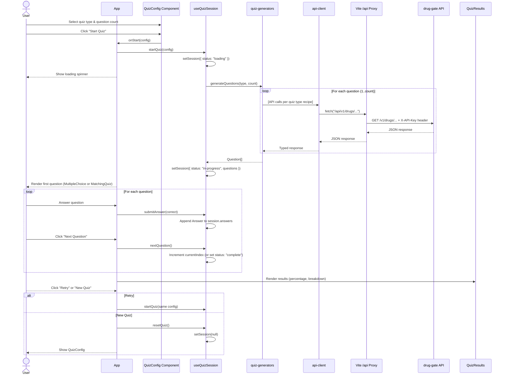
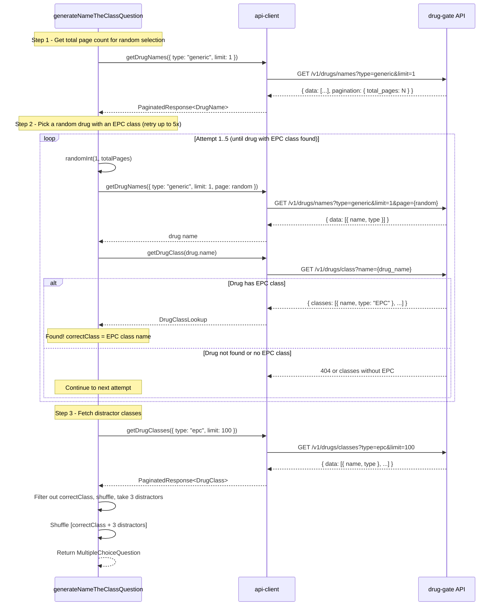
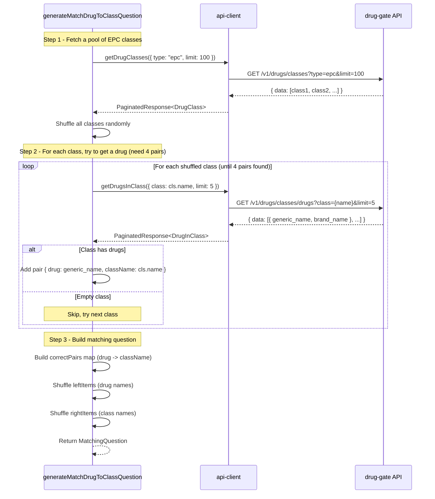
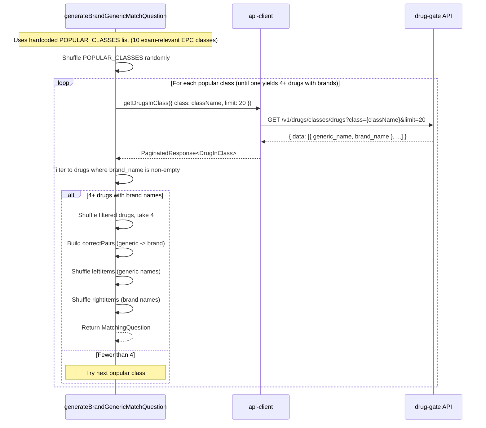
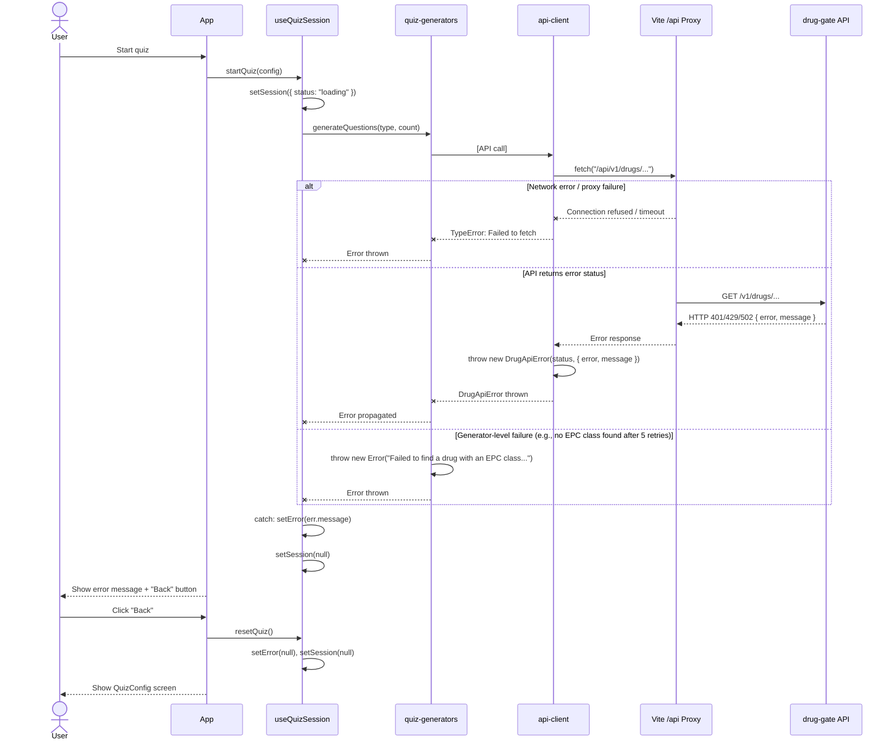

# Sequence Diagrams

Mermaid sequence diagrams for the key flows in drugs-quiz.

## 1. Quiz Session Flow (Full Lifecycle)

The end-to-end flow from user configuration through question generation, answering, and results.

## 2. Name the Class Question Generation

Implements the "Name the Class" recipe from `frontend-api-contract.md`.

## 3. Match Drug to Class Question Generation

Implements the "Match Drug to Class" recipe from `frontend-api-contract.md`.

## 4. Brand/Generic Match Question Generation

Implements the "Brand/Generic Match" recipe from `frontend-api-contract.md`.

## 5. Error Handling Flow

How API failures propagate from the network layer up to the user.

